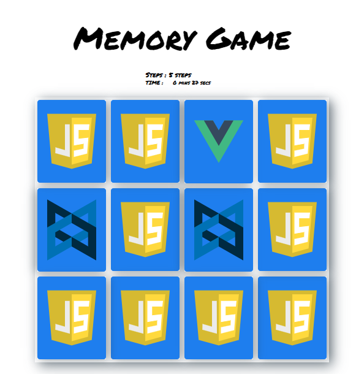

# memory-game-js
Memory game VanillaJS project

## What is the Memory Game
This is a simple game built to test a users memory. There's a deck of cards with different icons. 

## Challenge
Match cards in less time with less moves.

## How to Play
Load this link in your browser https://devvishalshukla.github.io/memory-game-js/

## Instructions
* Click on a card
* Keep revealing cards and working your memory to remember each unveiled card.
* Match cards properly with less moves and in faster time
